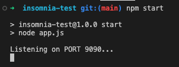
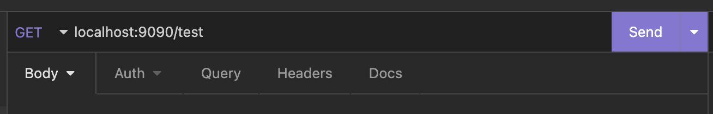
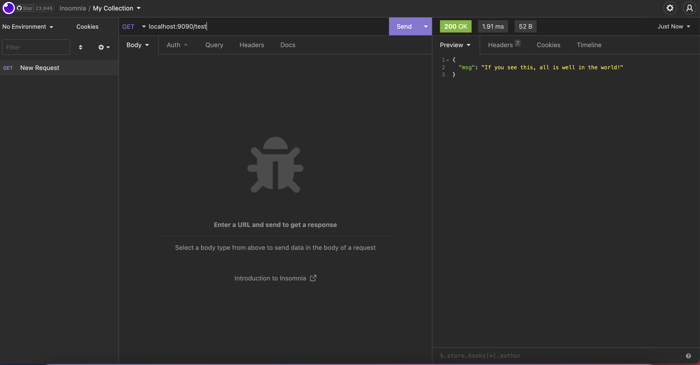

## Testing a NodeJS Server with Insomnia

Please head through the following instructions to ensure you will be able to create and start a NodeJS server as well as make requests to it from your local machine once we get into the back end block in a few weeks time.

Don't worry too much about the code in here or if some of the instructions seem ambiguous at this stage as we certainly will be covering it all!

We'd just like to make sure that we won't run into any problems when we get there.

1. Fork and clone this repository
2. Change directory - `cd insomnia-test`
3. Install _node modules_ - `npm install`
4. Start the server _listening_ - `npm start`

- You should see the following in your terminal

5. Head into Insomnia and make a GET request to the following address - `localhost:9090/test` and click `Send`

6. If you see the following response from your server on the right hand side of the Insomnia interface, you're all set!

7. Stop the server listening - `ctrl + c` in the terminal
